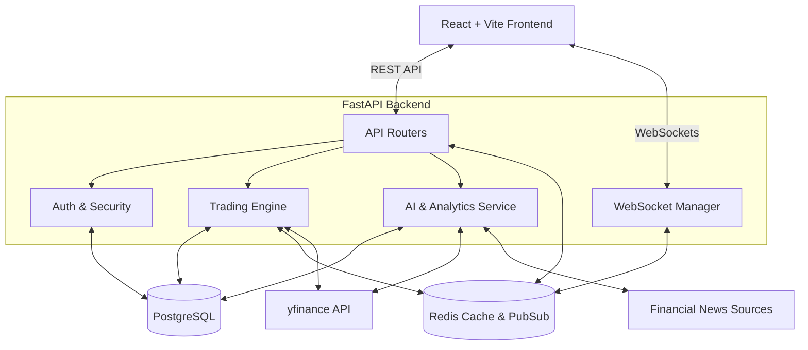

# System Architecture

The **AI Trading Simulator** is built using a modern, decoupled client-server architecture. It emphasizes scalability, real-time data processing, and maintainability.

## 🏗 Tech Stack

### Frontend
- **Framework**: React 18 powered by Vite for lightning-fast HMR and builds.
- **Styling**: Tailwind CSS, utilizing custom Glassmorphism aesthetics and CSS variables.
- **State Management**: Zustand for lightweight, scalable global state.
- **Data Fetching**: Axios and React Query (optional/extensible) for REST API communication.
- **WebSockets**: Native WebSocket API integration for live price feeds.

### Backend
- **Framework**: FastAPI (Python 3.11), chosen for its exceptional performance, async capabilities, and automatic OpenAPI documentation.
- **ORM & Database Management**: SQLAlchemy 2.0 (Async) with Alembic for migrations.
- **Market Data**: `yfinance` and `pandas` for fetching and analyzing stock data.
- **AI & Analytics**: `ta` (Technical Analysis library), `textblob`, and `newspaper3k` for sentiment and signals.

### Infrastructure & Databases
- **Primary Database**: PostgreSQL 16 (accessed asynchronously via `asyncpg`).
- **Caching & Pub/Sub**: Redis 7 for high-performance data caching, WebSocket broadcasting, and rate limiting.
- **Containerization**: Docker & Docker Compose for uniform environment replication.

## 📊 Architecture Diagram

Below is a high-level overview of how the components interact:

## Component Deep Dive

### 1. Security & Authentication (`app.core.security`)
All sensitive endpoints are protected using **JWT (JSON Web Tokens)**. Passwords are securely hashed using `passlib` (with `hashlib.sha256` in testing environments to bypass bcrypt compatibility issues) and verified upon login. We use Pydantic models to validate all incoming and outgoing data, preventing injection attacks.

### 2. The WebSocket Manager (`app.websocket.manager`)
To handle live price updates without overwhelming the server with HTTP polling, we implemented a custom WebSocket connection manager. 
- It tracks active connections and the specific "rooms" or "stock symbols" a user is subscribed to.
- A background task fetches data from `yfinance` periodically and publishes it to Redis.
- The WebSocket Manager subscribes to these Redis channels and broadcasts updates directly to the connected React clients.

### 3. The AI Module (`app.ai.*`)
Separated into specific submodules:
- `indicators.py`: Uses Pandas to calculate math-heavy metrics (RSI, MACD).
- `signals.py`: Aggregates indicators to produce a unified signal (Buy/Sell).
- `sentiment.py`: Scrapes and scores financial news.
- `backtesting.py`: Simulates historical trading based on algorithmic strategies.

## Deployment Strategy
The application is designed to be deployed via **Docker Compose** (for self-hosting/local dev) or decoupled to PaaS providers like **Render** (as configured in our CI/CD pipeline). The backend exposes a `/health` endpoint to facilitate zero-downtime deployments.
